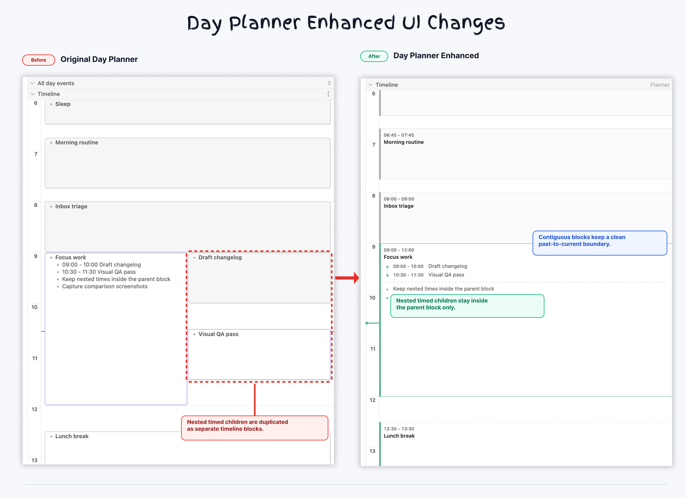
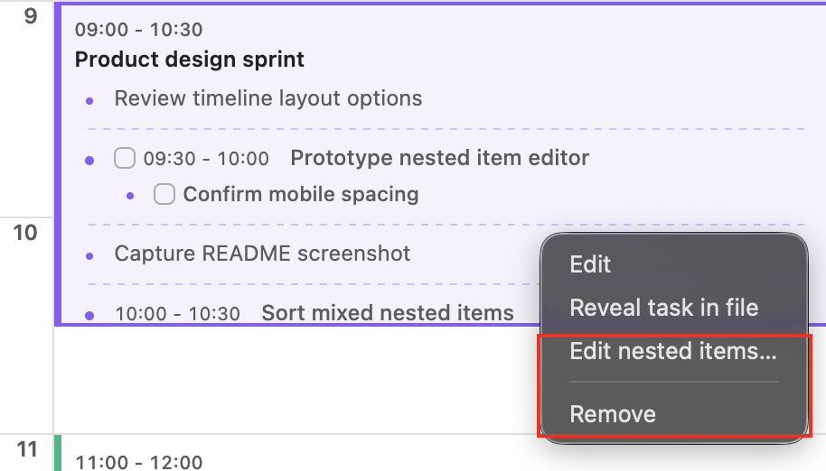
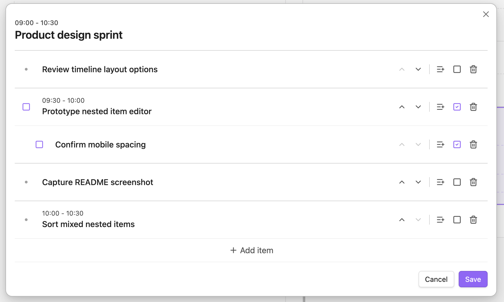
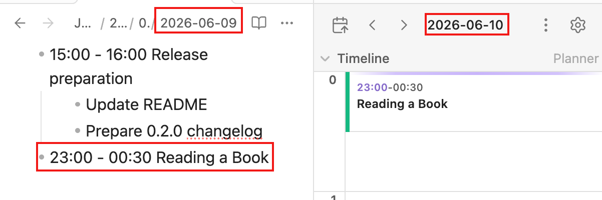

# Day Planner Enhanced

Day Planner Enhanced is a community plugin for [Obsidian](https://obsidian.md/). It adds editable calendar views, basic time-tracking, and an enhanced timeline UI for readable nested schedules.



<p align="center"><em>Nested timed and untimed child items stay readable inside the parent timeline block.</em></p>

This plugin is an independent MIT-licensed fork of [Obsidian Day Planner](https://github.com/ivan-lednev/obsidian-day-planner).

## What Enhanced adds

Day Planner Enhanced keeps the original Day Planner workflow, then adds tools for people who plan with nested daily schedules.

### 1. Nested schedules stay grouped in the timeline

Timed and untimed child items render inside the parent timeline block instead of becoming separate overlapping blocks. A work block can keep its meetings, breaks, and context notes together.

### 2. Timeline actions include nested editing and removal

Right-click a timeline block to edit the parent item, reveal it in the source file, manage nested items, or remove the whole planner item with its nested subtree.



<p align="center"><em>The context menu adds nested-item management and full-subtree removal directly from the timeline.</em></p>

### 3. Nested items can be managed without leaving the planner

The nested item manager can add root items, add child items, edit text by clicking the item body, move siblings, delete subtrees, convert bullets into checkbox tasks, and toggle completion. Saving replaces only the child subtree and keeps the parent planner line intact.



<p align="center"><em>Edit nested schedules as a small tree, then save the result back to the source markdown.</em></p>

### 4. Overnight plans continue across days

Plans that cross midnight stay anchored to the day where they start while still appearing naturally in the next day's timeline. A `23:00 - 00:30` entry can remain in the start day's daily note instead of being split into separate notes.



<p align="center"><em>Overnight plans continue into the next day's timeline while staying in the start day's note.</em></p>

### 5. Smaller planning improvements

- **Timed group sorting**: timed groups are ordered by time while untimed notes stay attached to the timed item they follow.
- **Smoother timeline editing**: click-created blocks use the clicked time as their start, move-block dragging follows the configured snap interval from the block's original position, end-of-day moves save the visible `23:59` boundary, newly created blocks stay selected while you type, and auto-scroll waits while you are interacting with the planner.
- **Undo-friendly removal**: timeline block removal is immediate from the context menu and still uses the undoable edit path.
- **Theme-aware UI polish**: nested dividers, dots, time ranges, mobile controls, and checkbox colors are tuned for scanning and Obsidian themes.
- **Separate plugin identity**: installs as `day-planner-enhanced`, so it can live separately from the original Day Planner plugin.

- 🪲 [Report bugs and suggest features](https://github.com/jagaldol/obsidian-day-planner-enhanced/issues)
- 🛠️ [Submit pull requests](./CONTRIBUTING.md)

Day Planner Enhanced is integrated with

- The core Daily Notes plugin.
- [the Tasks plugin](https://obsidian.md/plugins?id=obsidian-tasks-plugin)
- Online calendars

## Table of contents

- [Table of contents](#table-of-contents)
- [What Enhanced adds](#what-enhanced-adds)
  - [1. Nested schedules stay grouped in the timeline](#1-nested-schedules-stay-grouped-in-the-timeline)
  - [2. Timeline actions include nested editing and removal](#2-timeline-actions-include-nested-editing-and-removal)
  - [3. Nested items can be managed without leaving the planner](#3-nested-items-can-be-managed-without-leaving-the-planner)
  - [4. Overnight plans continue across days](#4-overnight-plans-continue-across-days)
  - [5. Smaller planning improvements](#5-smaller-planning-improvements)
- [Installation](#installation)
  - [Install from Obsidian](#install-from-obsidian)
  - [Manual installation fallback](#manual-installation-fallback)
  - [Updating](#updating)
- [How to use it](#how-to-use-it)
  - [1. Showing events from your daily notes](#1-showing-events-from-your-daily-notes)
    - [Overnight plans](#overnight-plans)
    - [Editing nested items](#editing-nested-items)
  - [2. tasks community plugin integration, showing events from other files in your vault](#2-tasks-community-plugin-integration-showing-events-from-other-files-in-your-vault)
  - [3. Showing internet calendars](#3-showing-internet-calendars)
    - [Where to get a Google Calendar link](#where-to-get-a-google-calendar-link)
    - [Where to get an iCloud link](#where-to-get-an-icloud-link)
    - [Where to get an Outlook link](#where-to-get-an-outlook-link)
      - [Alternative](#alternative)
  - [4. Time tracking](#4-time-tracking)
    - [Recording clocks](#recording-clocks)
    - [Clocks in timelines](#clocks-in-timelines)
    - [Active clocks](#active-clocks)
    - [Limitations](#limitations)
- [Upstream](#upstream)
- [Acknowledgements](#acknowledgements)

## Installation

Day Planner Enhanced is listed in Obsidian's community plugin directory and can be installed from Obsidian's built-in community plugin browser.

Day Planner Enhanced requires Obsidian 1.11.0 or newer.

Before installing, disable the original Day Planner plugin if it is already enabled in the same vault. This fork has its own plugin identity, but it still shares some Day Planner concepts, commands, and view behavior from the upstream codebase.

### Install from Obsidian

This is the recommended way to install and update the plugin.

1. Open **Settings → Community plugins** in Obsidian.
2. Select **Browse**.
3. Search for `Day Planner Enhanced`.
4. Install and enable the plugin.

### Manual installation fallback

1. Open the [latest release](https://github.com/jagaldol/obsidian-day-planner-enhanced/releases/latest).
2. Download these release assets:
   - `main.js`
   - `manifest.json`
   - `styles.css`
3. Create the plugin folder in your vault:

   ```text
   <vault>/.obsidian/plugins/day-planner-enhanced/
   ```

4. Put `main.js`, `manifest.json`, and `styles.css` directly inside that folder.
5. Restart or reload Obsidian.
6. Enable `Day Planner Enhanced` in Obsidian's community plugin settings.

### Updating

- If you installed from Obsidian's community plugin browser, update through Obsidian's community plugin settings.
- If you installed manually, download the latest release assets and replace the existing files in the plugin folder.
- Restart or reload Obsidian after replacing plugin files.

## How to use it

To open the timeline in the sidebar:

- Either run the command: `Show Timeline`
- Or click the timeline icon in the left ribbon
  - 

To open multi-day planner:

- Either run the command: `Show multi-day planner`
- Or click on the icon in the left ribbon:
  - 

You can overview the upcoming 3 hours in the mini-timeline in the status bar:


If there are remote tasks, the blocks will be colored accordingly.

The plugin can display records from different sources:

1. Daily notes
2. Obsidian-tasks
3. Online calendars
4. Dataview clock properties

Let's go over each one of them.

### 1. Showing events from your daily notes

> [!Warning]
> Either the core 'Daily Notes' (core plugin) or the 'Periodic Notes' (community plugin, [see in Obsidian](obsidian://show-plugin?id=periodic-notes)) should be enabled. This is what allows day-planner to 'see' and interact with your daily notes.

Write your tasks in a daily note, and they show up on the timeline:

```md
# Day planner

- [ ] 10:00 - 10:30 Wake up
- [ ] 11:00 - 12:30 Grab a brush and put a little make-up
```

#### Overnight plans

Plans that cross midnight can stay written in the start day's daily note. Day Planner Enhanced keeps the original `23:00 - 00:30` line in that note and continues the block into the next day's timeline.

#### Editing nested items

Right-click a timeline block and choose **Edit nested items...** to manage the child list under that planner item. The editor can add items, add child items, update text by clicking an item body, move siblings up or down, delete nested subtrees, and switch bullets into checkbox tasks without changing the parent planner line.

### 2. [tasks community plugin](obsidian://show-plugin?id=obsidian-tasks-plugin) integration, showing events from other files in your vault

You can see tasks anywhere in the vault with dates added by the [tasks community plugin](obsidian://show-plugin?id=obsidian-tasks-plugin). This also works out of the box for all the files in the vault. You only need to add the `scheduled` property to a task in one of the formats:

- Shorthand, added by [tasks community plugin](obsidian://show-plugin?id=obsidian-tasks-plugin): `⏳ 2021-08-29`
  - Note that this plugin has a handy modal for adding these properties
- Full Dataview-like property: `[scheduled:: 2021-08-29]`
- Another Dataview format: `(scheduled:: 2021-08-29)`.

For example, these tasks will show up in the timeline:

```md
- [ ] #task 08:00 - 10:00 This task uses the shorthand format ⏳ 2021-08-29
- [ ] #task 11:00 - 13:00 This task uses the Dataview property format [scheduled:: 2021-08-29]
```

### 3. Showing internet calendars

To show events from internet calendars like **Google Calendar, iCloud Calendar and Outlook** you only need to add an ICS link in the plugin settings.


#### Where to get a Google Calendar link

> [!Warning]
> Make sure you copy the right link! It should end with `.ics`, otherwise, you won't see your events!

[Google Calendar instructions](https://support.google.com/calendar/answer/37648?hl=en#zippy=%2Csync-your-google-calendar-view-edit%2Cget-your-calendar-view-only)

#### Where to get an iCloud link

[iCloud Calendar instructions](https://www.souladvisor.com/help-centre/how-to-get-icloud-calendar-address-on-mac-in-ical-format)

#### Where to get an Outlook link

[Outlook Calendar instructions](https://support.microsoft.com/en-us/office/introduction-to-publishing-internet-calendars-a25e68d6-695a-41c6-a701-103d44ba151d?ui=en-us&rs=en-us&ad=us)

Here's the relevant part:

> Under the settings in Outlook **on the web**, go to Calendar > Shared calendars. Choose the calendar you wish to publish and the level of details that you want others to see.

Here's how the settings look on the web version:


##### Alternative

If your organization doesn't let you share your calendar this way, you might try [a different way described in the upstream project](https://github.com/ivan-lednev/obsidian-day-planner/issues/395).

### 4. Time tracking

> [!Warning]
> This feature is experimental and can break or change at any time in the near future. You can help to shape this feature by providing your feedback.

You can record time spent on tasks in the form of Dataview properties and then view the records as time blocks, much like planner entries.

Time tracking is enabled by default. Turn off **Enable time tracker** in the plugin settings to remove its views, timeline columns, and clock actions. Existing time records in Markdown are kept unchanged and become available again when you re-enable the feature.

#### Recording clocks

Start a clock by right-clicking on a task in the editor:


Stop the clock to record the time spent on a task or cancel it to discard the record:


There is a command for each of the menu items, available in the command palette or as a hotkey:


Use **Clock in on anything...** from the command palette or the status bar to search across tasks and Markdown files. Search terms are matched against task text and file paths in any order, and recently tracked entries are shown first.

You can also track time against an entire Markdown file. Whole-file clocks are stored in the file's `planner.log` frontmatter and appear alongside task clocks in tracker views.

#### Clocks in timelines

You can enable an additional timeline column to see the recorded clocks next to your planner:


Right click (or tap and hold on mobile) a clock block to open its control menu:

- An active clock can be clocked out, edited or canceled
- A completed clock can be resumed, edited or deleted

#### Active clocks

You can see the currently active clocks in the timeline sidebar:


A right click on an active clock will bring the control menu:


The optional status bar widget shows the active clock and provides a shortcut to **Clock in on anything...**. It follows the main **Enable time tracker** setting, so disabling Time Tracker also hides the widget and clock commands without changing existing records.

#### Limitations

- Clock time blocks cannot be edited by dragging yet. Use the context menu to edit clock times.

## Upstream

Day Planner Enhanced is maintained as an independent fork of [Obsidian Day Planner](https://github.com/ivan-lednev/obsidian-day-planner). Upstream changes can still be merged from the original project when useful, but this plugin has its own package identity, release versioning, and issue tracker.

## Acknowledgements

- Day Planner Enhanced is based on [Obsidian Day Planner](https://github.com/ivan-lednev/obsidian-day-planner).
- Thanks to [Michael Brenan](https://github.com/blacksmithgu) for Dataview
- Thanks to [James Lynch](https://github.com/lynchjames) for the original plugin
- Thanks to [Joshua Tazman Reinier](https://github.com/joshuatazrein) for his plugin that served as an inspiration
- Thanks to @liamcain for creating daily note utilities and a helpful calendar plugin
- Thanks to [Emacs Org Mode](https://orgmode.org/) for an idea of text-based time-tracking
- Thanks to [Toggl Track](https://track.toggl.com/timer) for an idea of a great time-tracking UI
