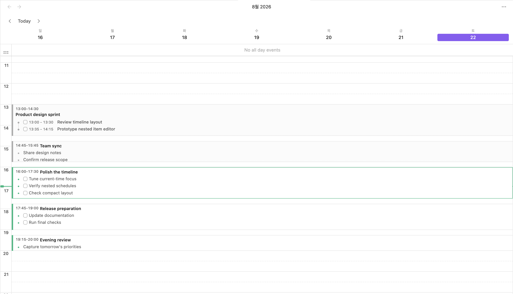
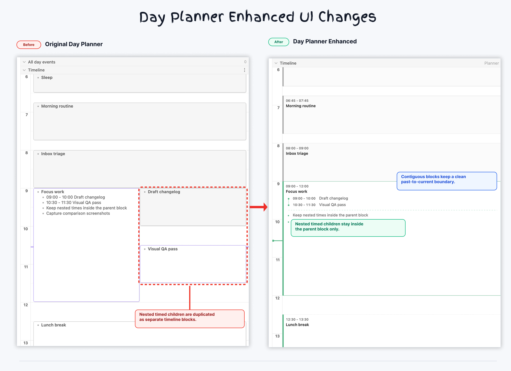
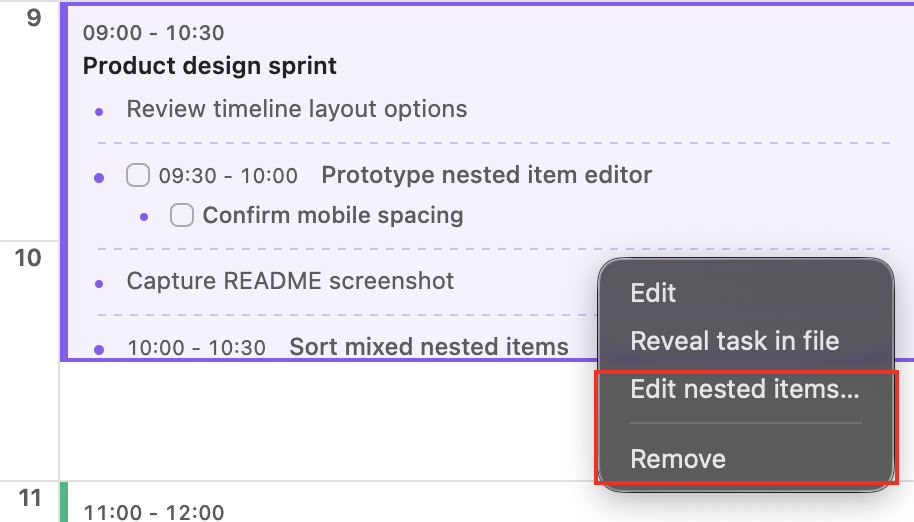
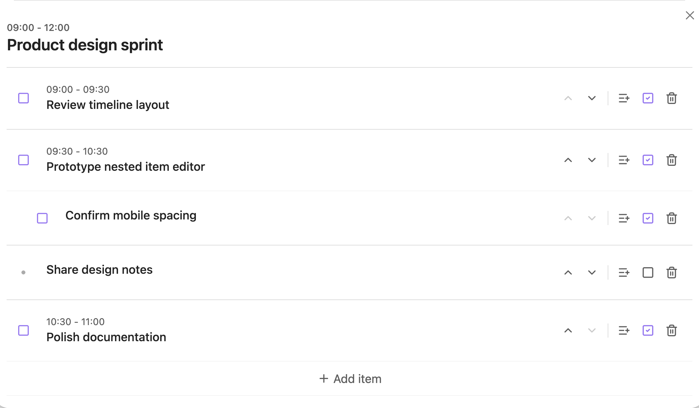
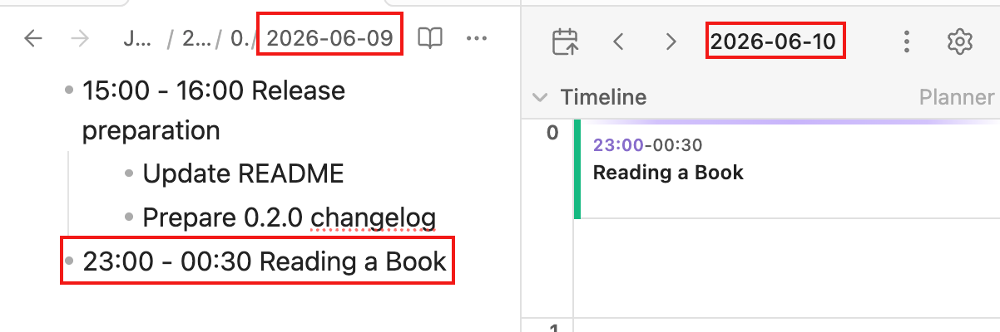

# Day Planner Enhanced

**Readable nested schedules for Obsidian.**

Day Planner Enhanced is an [Obsidian](https://obsidian.md/) community plugin for people who plan in nested Markdown lists. Child items stay readable inside their parent block instead of appearing again as separate Timeline or All Day entries.

[](https://obsidian.md/plugins?id=day-planner-enhanced)
[](https://github.com/jagaldol/obsidian-day-planner-enhanced/releases/latest)
[](https://github.com/jagaldol/obsidian-day-planner-enhanced)
[](./LICENSE)

[Install from Obsidian](https://obsidian.md/plugins?id=day-planner-enhanced) · [Latest release](https://github.com/jagaldol/obsidian-day-planner-enhanced/releases/latest) · [Changelog](./CHANGELOG.md) · [Report an issue](https://github.com/jagaldol/obsidian-day-planner-enhanced/issues)



<p align="center"><em>Past plans stay muted, the current block stays in focus, and nested schedules keep their structure.</em></p>

## Highlights

- **Keep nested plans together**: timed children keep their time ranges, while untimed notes stay attached to the same parent block.
- **Edit where you plan**: manage a nested tree from the timeline, including child items, task state, ordering, removal, and attachments.
- **Continue past midnight**: an overnight plan remains in the daily note where it starts and continues naturally into the next day's timeline.
- **Use the wider Day Planner workflow**: daily notes, Tasks integration, online calendars, editable calendar views, and time tracking remain available.
- **Keep an independent plugin identity**: the separate `day-planner-enhanced` ID keeps releases, settings, and issue tracking distinct. Disable the original Day Planner plugin before enabling this fork in the same vault.

## What Enhanced adds

Day Planner Enhanced keeps the original Day Planner workflow, then adds tools for people who plan with nested daily schedules.

### 1. Nested schedules stay grouped in the timeline

Timed and untimed child items render inside the parent timeline block instead of appearing again as separate Timeline or All Day entries. A work block can keep its meetings, breaks, and context notes together.



<p align="center"><em>Timed children keep their ranges, untimed notes stay attached, and duplicate overlapping blocks disappear.</em></p>

### 2. Timeline actions include nested editing and removal

Right-click a timeline block to edit the parent item, reveal it in the source file, manage nested items, or delete the whole planner item with its nested subtree.



<p align="center"><em>The context menu adds nested-item management and full-subtree removal directly from the timeline.</em></p>

### 3. Nested items can be managed without leaving the planner

The nested item manager can add root items, add child items, edit text by clicking the item body, move siblings, delete subtrees, convert bullets into checkbox tasks, and toggle completion. Changes save automatically when the editor closes, while the parent planner line stays intact.

Files and images can be pasted into nested items or the parent title. The editor follows Obsidian's attachment-folder and link-format settings, previews supported embeds, and waits for in-progress attachment saves before closing.



<p align="center"><em>Edit nested schedules as a small tree. Changes save automatically when the editor closes.</em></p>

### 4. Overnight plans continue across days

Plans that cross midnight stay anchored to the day where they start while still appearing naturally in the next day's timeline. A `23:00 - 00:30` entry can remain in the start day's daily note instead of being split into separate notes.



<p align="center"><em>Overnight plans continue into the next day's timeline while staying in the start day's note.</em></p>

### 5. Smaller planning improvements

- **Timed group sorting**: timed groups are ordered by time while untimed notes stay attached to the timed item they follow.
- **Smoother timeline editing**: click-created blocks use the clicked time as their start, move-block dragging follows the configured snap interval from the block's original position, end-of-day moves save the visible `23:59` boundary, newly created blocks stay selected while you type, and auto-scroll waits while you are interacting with the planner.
- **Undo-friendly removal**: timeline block removal is immediate from the context menu and still uses the undoable edit path.
- **Theme-aware UI polish**: nested dividers, dots, time ranges, mobile controls, and checkbox colors are tuned for scanning and Obsidian themes.
- **Flexible time-range display**: optionally hide the time range whenever a block uses a single-line header, including compact blocks.
- **Configurable timeline layout**: choose the first day of the week, use the same `1–5` zoom range in either settings surface, and resize the All Day row in single-day, sidebar, and multi-day views.
- **Stable block layout**: current-time markers, timeline controls, long titles, nested content, and All Day boundaries stay aligned across timeline layouts.
- **Separate plugin identity**: installs as `day-planner-enhanced`, so it can live separately from the original Day Planner plugin.

## Works with

- The core Daily Notes plugin or the Periodic Notes community plugin
- [Tasks](https://obsidian.md/plugins?id=obsidian-tasks-plugin)
- Google Calendar, iCloud Calendar, Outlook, and other ICS calendars
- Desktop and mobile Obsidian 1.11.0 or newer

## Installation

Day Planner Enhanced is listed in Obsidian's community plugin directory. [Open its official plugin page](https://obsidian.md/plugins?id=day-planner-enhanced), or install it from Obsidian's built-in community plugin browser.

Day Planner Enhanced requires Obsidian 1.11.0 or newer.

Before installing, disable the original Day Planner plugin if it is already enabled in the same vault. This fork has its own plugin identity, but it still shares some Day Planner concepts, commands, and view behavior from the upstream codebase.

### Install from Obsidian

This is the recommended way to install and update the plugin.

1. Open **Settings → Community plugins** in Obsidian.
2. Select **Browse**.
3. Search for `Day Planner Enhanced`.
4. Install and enable the plugin.

### Manual installation fallback

1. Open the [latest release](https://github.com/jagaldol/obsidian-day-planner-enhanced/releases/latest).
2. Download these release assets:
   - `main.js`
   - `manifest.json`
   - `styles.css`
3. Create the plugin folder in your vault:

   ```text
   <vault>/.obsidian/plugins/day-planner-enhanced/
   ```

4. Put `main.js`, `manifest.json`, and `styles.css` directly inside that folder.
5. Restart or reload Obsidian.
6. Enable `Day Planner Enhanced` in Obsidian's community plugin settings.

### Updating

- If you installed from Obsidian's community plugin browser, update through Obsidian's community plugin settings.
- If you installed manually, download the latest release assets and replace the existing files in the plugin folder.
- Restart or reload Obsidian after replacing plugin files.

## How to use

To open the timeline in the sidebar:

- Run the `Show Timeline` command, or select the timeline icon in the left ribbon:
  - 

To open the multi-day planner:

- Run the `Show multi-day planner` command, or select its icon in the left ribbon:
  - 

The mini-timeline in the status bar shows the next three hours:


Blocks from remote sources use their configured source colors.

The plugin can display items from several sources:

1. Daily notes
2. Tasks
3. Online calendars
4. Dataview clock properties

### 1. Showing events from your daily notes

> [!WARNING]
> Enable either the core Daily Notes plugin or the [Periodic Notes community plugin](https://obsidian.md/plugins?id=periodic-notes). Day Planner Enhanced uses one of these plugins to find and update your daily notes.

Write your tasks in a daily note, and they show up on the timeline:

```md
# Day planner

- [ ] 10:00 - 10:30 Plan the day
- [ ] 11:00 - 12:30 Deep work session
```

#### Overnight plans

Plans that cross midnight can stay written in the start day's daily note. Day Planner Enhanced keeps the original `23:00 - 00:30` line in that note and continues the block into the next day's timeline.

#### Editing nested items

Right-click a timeline block and choose **Edit nested items...** to manage the child list under that planner item. The editor can add items, add child items, update text by clicking an item body, move siblings up or down, delete nested subtrees, and switch bullets into checkbox tasks without changing the parent planner line. Changes are saved automatically when the editor closes.

Pasting a file or an image into an item (or into the parent title) saves it to your configured attachment folder and inserts a link to it. Images, audio, video, and PDFs are inserted as embeds; other file types are inserted as plain links. Obsidian's attachment-folder and link-format settings are respected. When the source note is not the active note, third-party attachment transformations that depend on the active editor (such as custom renaming or format conversion) may not run; the explicit source-note location is kept instead so the file cannot be saved relative to the wrong note.

Timeline blocks are only as tall as their time range, so by default an embed is shown as a plain link there to keep the task text and time range visible. Turn on **Show embeds in timeline blocks** to render images and PDFs in the block itself. The nested items editor always renders embeds.

### 2. Showing scheduled Tasks from other files

Tasks anywhere in your vault can appear on the timeline when they have a scheduled date from the [Tasks community plugin](https://obsidian.md/plugins?id=obsidian-tasks-plugin). Add a `scheduled` property in one of these formats:

- Tasks shorthand: `⏳ 2021-08-29`
  - The Tasks plugin includes a modal for adding these properties.
- Full Dataview-like property: `[scheduled:: 2021-08-29]`
- Parenthesized Dataview format: `(scheduled:: 2021-08-29)`

For example, these tasks will show up in the timeline:

```md
- [ ] #task 08:00 - 10:00 This task uses the shorthand format ⏳ 2021-08-29
- [ ] #task 11:00 - 13:00 This task uses the Dataview property format [scheduled:: 2021-08-29]
```

An explicit Tasks scheduled date takes precedence over the date of a containing daily note. If the scheduled date is missing or invalid, the daily note date is used as the fallback.

One or more leading Obsidian tags may appear immediately before either a single start time or a complete time range. A single start time uses the configured default task duration. When the timestamp format is `HHmm`, a compact single time such as `#task 1000 Focus` is accepted only in this leading-tag form; untagged compact numbers and time expressions elsewhere in the task description remain ordinary text.

Enable **Tasks integration → Hide Tasks metadata in planner** to keep task descriptions and tags visible while hiding Tasks dates and completion, recurrence, priority, IDs, dependencies, on-completion behavior, and inline fields such as `(scheduled:: …)` inside Day Planner blocks. This only changes the rendered timeline; source notes and scheduling metadata remain unchanged. The setting is off by default.

### 3. Showing internet calendars

To show events from internet calendars such as **Google Calendar, iCloud Calendar, and Outlook**, add an ICS link in the plugin settings.


#### Where to get a Google Calendar link

> [!WARNING]
> Make sure you copy the right link! It should end with `.ics`, otherwise, you won't see your events!

[Google Calendar instructions](https://support.google.com/calendar/answer/37648?hl=en#zippy=%2Csync-your-google-calendar-view-edit%2Cget-your-calendar-view-only)

#### Where to get an iCloud link

[iCloud Calendar instructions](https://www.souladvisor.com/help-centre/how-to-get-icloud-calendar-address-on-mac-in-ical-format)

#### Where to get an Outlook link

[Outlook Calendar instructions](https://support.microsoft.com/en-us/office/introduction-to-publishing-internet-calendars-a25e68d6-695a-41c6-a701-103d44ba151d?ui=en-us&rs=en-us&ad=us)

Here's the relevant part:

> Under the settings in Outlook **on the web**, go to Calendar > Shared calendars. Choose the calendar you wish to publish and the level of details that you want others to see.

Here's how the settings look on the web version:


##### Alternative

If your organization doesn't let you share your calendar this way, you might try [a different way described in the upstream project](https://github.com/ivan-lednev/obsidian-day-planner/issues/395).

### 4. Time tracking

> [!WARNING]
> This feature is experimental and can break or change at any time in the near future. You can help to shape this feature by providing your feedback.

You can record time spent on tasks in the form of Dataview properties and then view the records as time blocks, much like planner entries.

Time tracking is enabled by default. Turn off **Enable time tracker** in the plugin settings to remove its views, timeline column controls, clock commands, task-menu actions, and status-bar clock controls. If a clock is still running, the plugin warns before disabling the feature; the record remains open unless you cancel the change and clock out first. Existing time records and saved column preferences are kept unchanged and become available again when you re-enable the feature.

#### Recording clocks

Start a clock by right-clicking on a task in the editor:


Stop the clock to record the time spent on a task or cancel it to discard the record:


There is a command for each of the menu items, available in the command palette or as a hotkey:


Use **Clock in on anything...** from the command palette or the status bar to search across tasks and Markdown files. Search terms are matched against task text and file paths in any order, and recently tracked entries are shown first.

You can also track time against an entire Markdown file. Whole-file clocks are stored in the file's `planner.log` frontmatter and appear alongside task clocks in tracker views.

#### Clocks in timelines

You can enable an additional timeline column to see the recorded clocks next to your planner:


Right click (or tap and hold on mobile) a clock block to open its control menu:

- An active clock can be clocked out, edited or canceled
- A completed clock can be resumed, edited or deleted

#### Active clocks

You can see the currently active clocks in the timeline sidebar:


Right-click an active clock to open its control menu:


The optional status bar widget shows the active clock and provides a shortcut to **Clock in on anything...**. It follows the main **Enable time tracker** setting, so disabling Time Tracker hides the widget and disables its dependent setting without changing existing records.

#### Limitations

- Clock time blocks cannot be edited by dragging yet. Use the context menu to edit clock times.

## Support and contribute

If Day Planner Enhanced makes your daily planning easier, [star the repository](https://github.com/jagaldol/obsidian-day-planner-enhanced). It helps other Obsidian users find the project and follow its development.

- 🪲 [Report bugs or suggest features](https://github.com/jagaldol/obsidian-day-planner-enhanced/issues)
- 🛠️ [Read the contribution guide](./CONTRIBUTING.md)

## Upstream

Day Planner Enhanced is an independent MIT-licensed fork of [Obsidian Day Planner](https://github.com/ivan-lednev/obsidian-day-planner). The current codebase is aligned with the upstream 0.35.1 baseline, including its week-strip timeline header, compact All Day row, shared **Timeline settings** modal, timeline clock-in actions, and current-time/status-bar fixes.

Useful upstream changes can continue to be merged, while this plugin keeps its own package identity, release versioning, enhancements, and issue tracker.

## Acknowledgements

- Day Planner Enhanced is based on [Obsidian Day Planner](https://github.com/ivan-lednev/obsidian-day-planner).
- Thanks to [Michael Brenan](https://github.com/blacksmithgu) for Dataview.
- Thanks to [James Lynch](https://github.com/lynchjames) for the original plugin.
- Thanks to Joshua Tazman Reinier for his plugin that served as an inspiration.
- Thanks to [Liam Cain](https://github.com/liamcain) for creating daily note utilities and a helpful calendar plugin.
- Thanks to [Emacs Org Mode](https://orgmode.org/) for the idea of text-based time tracking.
- Thanks to [Toggl Track](https://track.toggl.com/timer) for inspiring the time-tracking UI.
